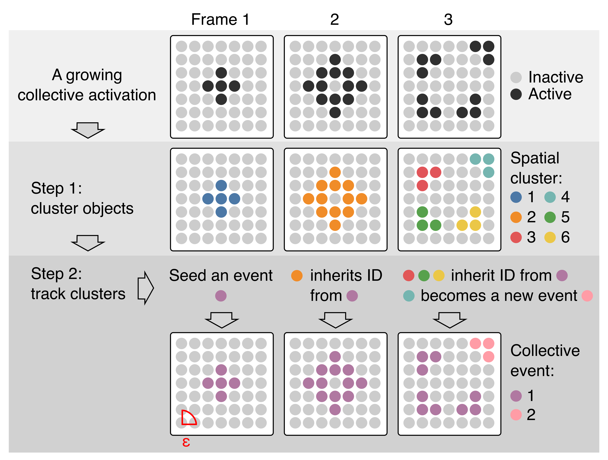
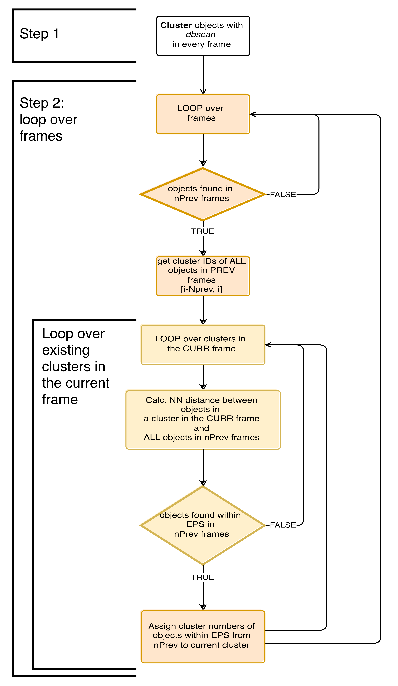

# Event Detection and Tracking

### Identification of spatial clusters

A dbscan algorithm first spatially clusters entities deemed active in each frame. In step 2, clusters are sequentially linked between frames to capture collective events over time. The cluster in frame one forms a seed of a collective event. The cluster in frame two is linked to this seed cluster because several of its member cells are within the neighbourhood radius 𝜀. In frame three, only clusters #3, #5, & #6 are linked to the previous frame’s cluster. Cells in cluster #4 are too far and thus form a new seed of a collective event.

### Flow-Chart overview of ARCOS event detection

The flow chart below outlines the steps in the algorithm.&#x20;

