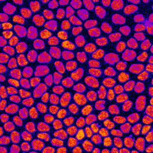
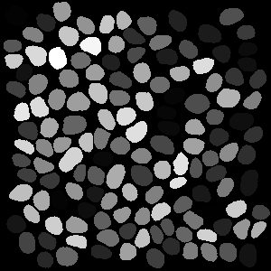
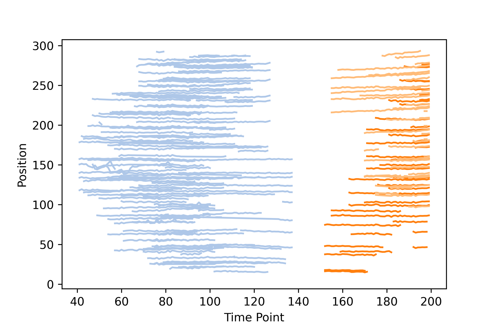

# Detecting Collective signalling events in epithelial Cells


The following describes an example image processing pipeline written in python to analyse collective events in an MDCK epithelium. What we are aiming for can be seen in the gif above. First, the erk measurement is extracted from the images and the individual nuclei are tracked. The second step shows how to analyse the data with ARCOS. Similar results can be achieved with standalone tools such as CellProfiler and Ilastik. And both the R and Python packages can be used after preparing the data.

In the following zip file, you can find both the input data and the generated output from the image segmentation pipeline and ARCOS.


Example Dataset, credit Paolo Gagliardi


## Data Preparation

The data in this example is from an MDCK cell line that stably expresses a fluorescent FRET biosensor reporting the activity of the ERK kinase.

In the first step, the nuclei are segmented using the stardist python package.&#x20;

Subsequently, the mean intensity of individual objects in the ratio image is measured and the individual nuclei are tracked over time.&#x20;

### Import libraries and define custom functions

```python
import os
import skimage
import numpy
import errno

from stardist.models import StarDist2D
from csbdeep.utils import normalize
from skimage.measure import regionprops, regionprops_table
from skimage.util import map_array

import pandas as pd
import trackpy
```

```python
def create_folders(path: str, folder: list):
    for i in folder:
        folder_to_make = os.path.join(path, i)
        try:
            os.makedirs(folder_to_make)
            print(f'folder "{i}" created')
        except OSError as e:
            print(f'folder "{i}" alrady exists')
            if e.errno != errno.EEXIST:
                raise
                
def remap_segmentation(df: pd.DataFrame, segmentation: list, timepoint_column: str = 'timepoint', label_column: str = 'label', measure_column: str = 'ERK') -> list:
    tracked_numpy = df[[timepoint_column, label_column, measure_column]].sort_values(timepoint_column).to_numpy()
    grouped_numpy = numpy.split(tracked_numpy,numpy.unique(tracked_numpy[:,0], return_index = True)[1][1:])
    ratio_remapped = []
    for img, grp in zip(segmentation, grouped_numpy):
        img_copy = map_array(img, grp[:,1], grp[:, 2])
        ratio_remapped.append(img_copy)
    return ratio_remapped
```

### Set variables

```python
PATH = 'example_data' # where is you data located   
FOLDER = 'mdck_ekar' # subfolder of PATH where images are stored
OUT_DATA = 'data' # subfolder of PATH where csv is stored
OUT_LABELS = 'stardist' # subfolder of PATH where stardist segmentation is stored
FILENAME = 'C3-041_Ori.tif'
full_path = os.path.join(PATH, FOLDER)
orig_images_path = os.path.join(PATH, FOLDER)
out_path_csv = os.path.join(PATH, OUT_DATA)
create_folders(PATH, [OUT_DATA, OUT_LABELS]) 
```

### Load image and stardist model

```python
model = StarDist2D.from_pretrained('2D_versatile_fluo') # standard stardist model for 2d segmentation
image_data = skimage.io.imread(os.path.join(orig_images_path, FILENAME)) 
```



### Segment Nuclei and extract values from image

```python
out_path_stardist = os.path.join(PATH, OUT_LABELS,  'stardist.tif')
segmentation = []
df = []

for t, tp_data in enumerate(image_data):
    print(f'analysing timepoint {t}')
    labels, _ = model.predict_instances(normalize(tp_data))
    labels = skimage.segmentation.clear_border(labels)
    dic = regionprops_table(labels, tp_data, properties=['label', 'centroid', 'intensity_mean', 'area'])
    dic['timepoint'] = numpy.repeat(t, len(dic['label']))
    df.append(pd.DataFrame(dic))
    skimage.segmentation.clear_border(labels)
    segmentation.append(labels)

# optionally save segmentation
skimage.io.imsave(out_path_stardist, numpy.stack(segmentation))
```



### Track Nuclei and save csv

```python
df_full = pd.concat(df)
df_full = df_full.rename(columns={"centroid-1": "x", "centroid-0": "y", 'intensity_mean': 'ERK'})
df_full = df_full.sort_values(['timepoint'])
df_tracked = trackpy.link_df(df_full, search_range = 10, memory = 2, t_column = 'timepoint')
df_tracked = df_tracked.reset_index(drop=True).rename(columns={'particle': "track_id"})
df_tracked.to_csv(out_path_csv+'\\tracked_data_fret.csv')
```

| label | y         | x         | ERK       | area | timepoint | track\_id |
| ----- | --------- | --------- | --------- | ---- | --------- | --------- |
| 1     | 234.0361  | 234.21661 | 24.241877 | 277  | 0         | 0         |
| 15    | 247.75668 | 17.486647 | 20.970326 | 337  | 0         | 1         |
| 14    | 201.73333 | 275.54409 | 22.105376 | 465  | 0         | 2         |
| 13    | 282.29854 | 274.37136 | 23.169903 | 412  | 0         | 3         |
| 12    | 79.808989 | 26.254682 | 23.794007 | 267  | 0         | 4         |

## Analyse data with ARCOS

In this example, the python package arcos4py is used. But the same analysis could be carried out easily with the R package or the napari plugin.

### Imports

```python
from arcos4py import ARCOS
from arcos4py.tools import filterCollev
from arcos4py.plotting import NoodlePlot
```

### Detect Collective Events

```python
ts = ARCOS(df_tracked, ["x", "y"], 'timepoint','track_id', 'ERK')
ts.interpolate_measurements()
ts.bin_measurements(biasMet='none', binThr=0.28)
df_arcos = ts.trackCollev(eps=40, minClsz=5)
```

### Filter Collective Events

```python
filterer = filterCollev(df_arcos, 'timepoint', 'clTrackID', 'track_id')
ts_filtered = filterer.filter(25, 10)
```

| timepoint | track\_id | x         | y         | clTrackID | label | ERK       | area | ERK.resc | ERK.bin |
| --------- | --------- | --------- | --------- | --------- | ----- | --------- | ---- | -------- | ------- |
| 41        | 45        | 178.5023  | 159.9447  | 2         | 84    | 24.069124 | 434  | 0.309875 | 1       |
| 41        | 69        | 133.91586 | 161.19741 | 2         | 66    | 29.385113 | 309  | 0.780246 | 1       |
| 41        | 80        | 157.38387 | 171.76452 | 2         | 79    | 26.158065 | 310  | 0.575343 | 1       |
| 41        | 121       | 157.41818 | 112.88182 | 2         | 133   | 22.369697 | 330  | 0.312039 | 1       |
| 41        | 122       | 118.09012 | 132.79361 | 2         | 92    | 29.494186 | 344  | 0.862141 | 1       |

### Plot NoodlePlot

```python
NoodlePlot(ts_filtered, 'clTrackID', 'track_id', 'timepoint', 'x', 'y').plot('x')
```



## Visualize Events in Napari

This step is optional and only one way to visualize events but can be usefull to validate correct event detection.

### Imports

```python
from napari import Viewer

TAB20 = [
    "#1f77b4",
    "#aec7e8",
    "#ff7f0e",
    "#ffbb78",
    "#2ca02c",
    "#98df8a",
    "#d62728",
    "#ff9896",
    "#9467bd",
    "#c5b0d5",
    "#8c564b",
    "#c49c94",
    "#e377c2",
    "#f7b6d2",
    "#7f7f7f",
    "#c7c7c7",
    "#bcbd22",
    "#dbdb8d",
    "#17becf",
    "#9edae5",
]
```

### Prepare Data

```python
np_data = df_tracked[['track_id', 'timepoint', 'y', 'x']].to_numpy()
colors = numpy.take(numpy.array(TAB20), ts_filtered['clTrackID'].unique(), mode="wrap")
df_w_colors = pd.merge(ts_filtered, pd.DataFrame(data={'colors': colors, 'clTrackID': ts_filtered['clTrackID'].unique()}))
points_data = df_w_colors[['timepoint', 'y', 'x']].to_numpy()
colors_data = df_w_colors['colors'].to_numpy('str')
```

### Remap measured Ratio to segmented labels

```python
ratio_remapped = remap_segmentation(df_tracked, segmentation)
ratio_remapped = numpy.stack(ratio_remapped)
```

### Open Napari and add Layers

```python
viewer = Viewer()
viewer.add_image(image_data, name='ERK Ratio image', colormap='inferno')
viewer.add_image(ratio_remapped, colormap='viridis')
viewer.add_labels(numpy.stack(segmentation), name='segmentation', visible=False)
viewer.add_tracks(np_data, name='cell tracks')
viewer.add_points(points_data, face_color=colors_data, name='collective events')
```



Download the jupyter notebook

